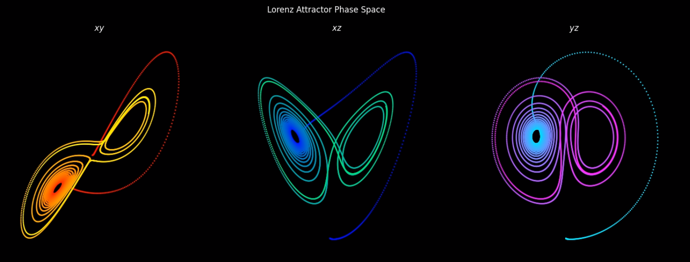

# The Lorenz Attractor: Animating Chaos

This repository contains a Python program that generates an animation of the phase space of a Lorenz attractor, which is a set of solutions to the Lorenz System. The Lorenz system itself is a set of three differential equations that describe a simplified model for atmospheric convection. The equations describing a Lorenz system are given by 
$$\frac{dx}{dt} = \sigma (y - x)$$
$$\frac{dy}{dt} = x (\rho - z) - y$$
$$\frac{dz}{dt} = xy - \beta z.$$ 
The program calculates the derivatives of the system variables and solves the differential equations numerically using SciPy. The parameters of the Lorenz system, such as $\sigma$, $\beta$, and $\rho$, can be specified in the `params.json` file. If the file is not provided when running the Python program, then the default values are used. The resulting trajectory is then animated according to the specified parameters, and the animation is saved as an MP4 file `output.mp4`.

Here is a snapshot of an animation using the default `params.json` configuration:

  

## Usage

1. Clone this repository
2. Open a terminal and navigate to the project directory
3. Install the required packages by running `pip install -r requirements.txt`
4. Run `python lorenz.py` or, for configured parameters, `python lorenz.py params.json` 
5. When the program has finished, view the animation by running `xdg-open output.mp4`

## License

This project is licensed under the GNU GPL - see the LICENSE file for details.
